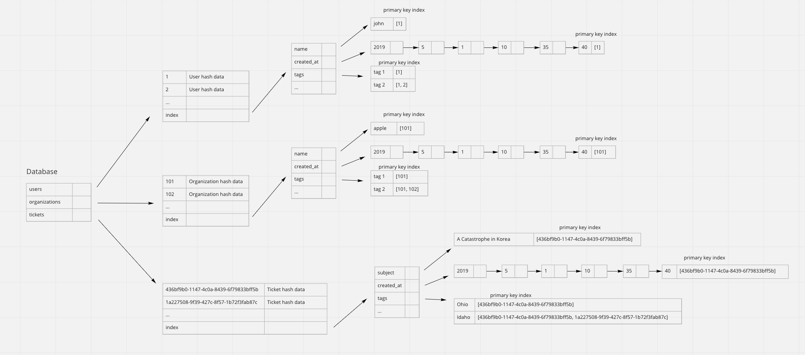
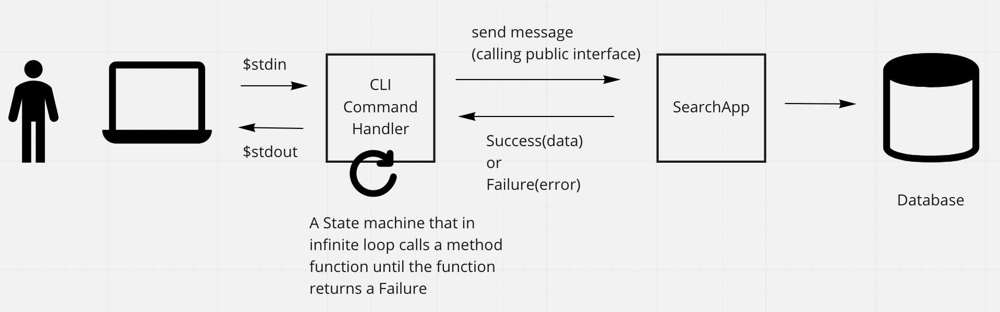
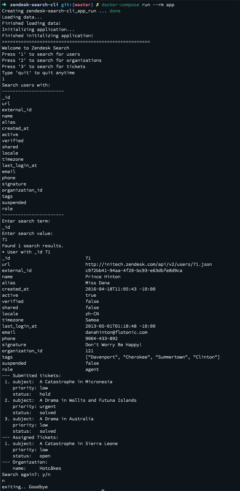
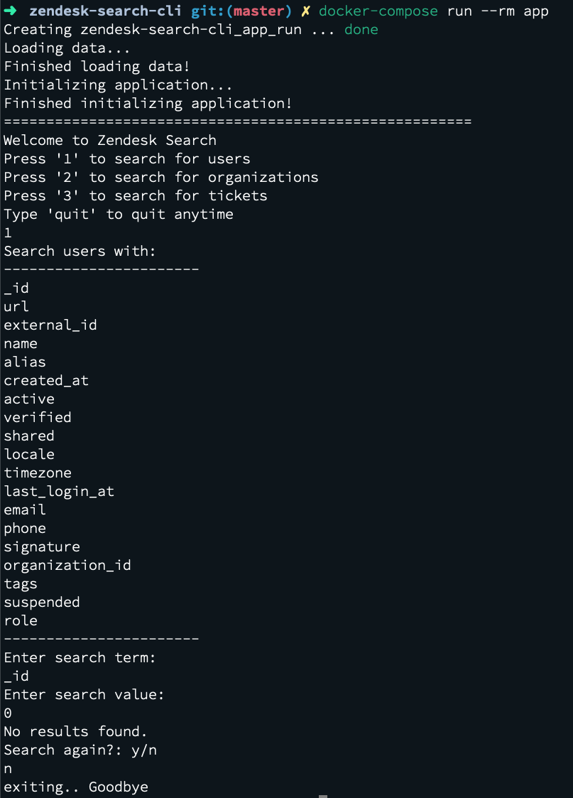

- [Zendesk Seach App](#zendesk-seach-app)
  - [Usage](#usage)
    - [Requirements](#requirements)
      - [1. With Docker](#1-with-docker)
      - [2. Without Docker](#2-without-docker)
    - [Running the app](#running-the-app)
      - [1. With Docker](#1-with-docker-1)
      - [2. Without Docker](#2-without-docker-1)
    - [Development](#development)
      - [1. With Docker](#1-with-docker-2)
      - [2. Without Docker](#2-without-docker-2)
  - [Assumption](#assumption)
  - [Approach](#approach)
    - [Database](#database)
    - [High level architecture](#high-level-architecture)
    - [App design](#app-design)
    - [Error Handling](#error-handling)
    - [Thoughts on modules](#thoughts-on-modules)
  - [Screnshots](#screnshots)
    - [1. Sample results](#1-sample-results)
    - [2. Sample no results](#2-sample-no-results)

Zendesk Seach App
====================

This repo a CLI (Command Line Interface) search application that is used to demonstrate ability to search data and return the results in a human readable formats. This is used for the coding challenge submisison for Zendesk Melbourne.

## Usage

### Requirements
#### 1. With Docker
Install the followings:
* [Docker](https://docs.docker.com/get-docker/)
* [Docker compose](https://docs.docker.com/compose/install/)
#### 2. Without Docker
Install the followings:
* [ruby with minimum version 3.0.0](https://www.ruby-lang.org/en/downloads/)
* run `bundle install` to the libraries

### Running the app
#### 1. With Docker
run `docker-compose run --rm app`
#### 2. Without Docker
run `./bin/run`

### Development
#### 1. With Docker
* Access the bash console with `docker-compose run --rm app bash`
* run tests with `docker-compose run --rm app bundle exec rspec`
* run rubocop (ruby's static code analyzer) with `docker-compose run --rm app bundle exec rubocop`
#### 2. Without Docker
* run tests with `bundle exec rspec`
* run rubocop (ruby's static code analyzer) with `bundle exec rubocop`

## Assumption

* The schema in `lib/schema.rb` represents the structure of the input data for users, organizations, and tickets. This means that any extra attributes provided in the input data will be considered an invalid data and the application will return an error.
* When parsing the input data, a coercion is made on the value for the database. see the followings for the coercion assumption made:
  * For data with schema type of a `String`, a `null` value will be coerced to an empty string, and the value will be downcased.
  * For data with schema type of a `Integer`, a `null` value will be coerced to a `0` integer.
  * For data with schema type of a `Boolean`, any value that is not a `true` boolean will be coerced to a `false` boolean.
  * For data with schema type of a `Time`, the value is parsed as UTC time into time attributes which consists of year, month, day, hour, minute, seconds. if any invalid time value is provided, the application will return an error.
  * For data with schema type of a `Array[String]`, the value will be parsed as multiple of the `String` schema type.
  * Other data types (like `Array[Integer]`) is not added because it is not needed in the current schema. This other types can be easily added in later when neded.
* The provided CLI is slighty different from the one outlined in the instruction, the list of searchable fields is not an option the user has to choose, but it's by default provided when the user need to enter the search term. This makes it easier to use the search app, and this change is assumed to be okay.
* The user is able to search with case insensitive value.
* A full value matching is assumed in this search app.

## Approach

Libraries used:
* Rspec - for testing.
* Simplecov - for tests coverage.
* Rubocop - Static code analyzer.
* Dry Monads - help with way of handling errors, exceptions and chaining functions.

### Database

For this search app, a ruby hash is mainly used to store the data. A hash is chosen because it has a linear time complexity for search and insertion which is the main use case here.

Given the use case of the search app, where it's mostly a Read operation and the only Write operation is at the initialization of the app and also the feature of being able to search efficiently on any fields, all the fields aside the primary key (as defined in the schema) are being indexed. At the end of each each indexes is an array of primary key that can be used to easily access the data.

The `Time` value is being parsed in UTC time as [year, month, day, hour, minute, second]. This decision may seem over-engineered, but I believe that this is the proper way to store a time value. The other alternative is to store time as an ISO8601 string and trading the dilution of the time's details in the indexes with simplicity.

See the following diagram for an illustration of the Database modelling:

### High level architecture

The general high level architecture is illustrated as following:

### App design

The design of this app is heavily influenced by the ["Railway Oriented Programming" style](https://fsharpforfunandprofit.com/rop/). To help achieve this, I mainly use [Dry::Monads](https://dry-rb.org/gems/dry-monads/1.3/) as the interface of the result value.

### Error Handling

Error Handling in this App is very explicit and avoid raising exception where possible. In the case where an exception does occur, it is deemed to be an unexpected and unrecoverrable error. In general, an explicit error as a value is returned when an error due to bad data or violation of business logic.

### Thoughts on modules

The following explains the thought process on the file or module namespace used in this app:

* SearchApp - This file is the main search application that is decoupled from the IO. This will return either a `Success(value)` or `Failure(error)`.
* Main - This file is the glue that binds the `SearchApp` with the relevant `Handlers` to be able to run the application on the bin file.
* Schema - This is the schema of the users, organizations, tickets data.
* Repository - This provides a high level abstraction which interacts with the Database and understand the Domain model of users, tickets, and organizations.
* Handlers - These are a collection of objects that heavily interact with the IO. These sit outside the SearchApp and are the glue between the `Main` and the `App`.
* Models - These are collection of model that represents a domain model and carry state.
* Services - Theses are service objects that acts like a helper function to do a simple validation logic or generate object.
* Representers - These provide the representation concern of a data/model.
* Parsers - These parse value from one type to another. These will return `Some(value)` or a `None`.

## Screnshots

### 1. Sample results

### 2. Sample no results

